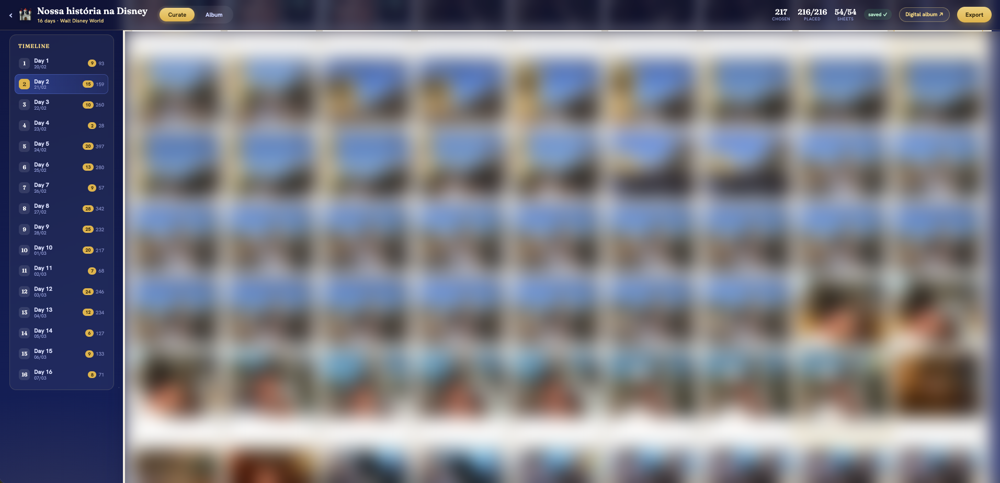
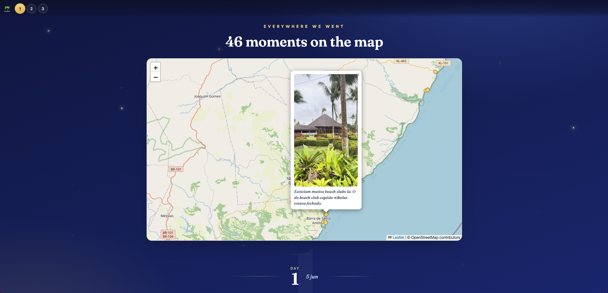
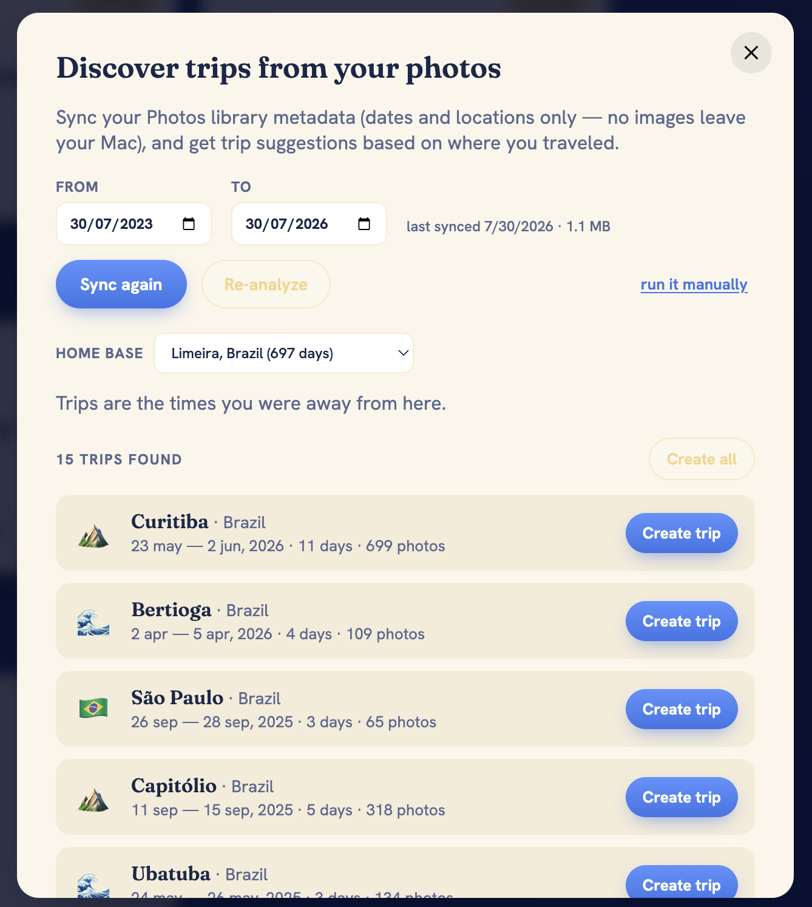

# OurAdventureBook 📖

Turn a trip's thousands of photos into a real album — curate day by day, lay out a
physical album, export print‑ready photos and a photobook PDF, and share a cinematic
digital album.

Everything runs **locally** and reads directly from your **Apple Photos** library
(via [osxphotos](https://github.com/RhetTbull/osxphotos)). Your photos and captions
never leave your machine.

## Screenshots

**Curate** — pick the best photos day by day, straight from your Apple Photos library.



**Album** — lay out the physical album (2 photos + a caption column per side), sheet by sheet.


**Digital album** — a shareable web story with every geotagged photo on an interactive map.



**Discover trips** — scan your Photos library and get trip suggestions (destination, dates, photo count) ready to create in one click.



> Photos in the Curate/Album screenshots are blurred for privacy; the app itself shows them sharp.

## Features

- **Multi‑trip** — one self‑contained folder per trip (`trips/<slug>/`).
- **Discover trips from your photos** — the app scans your library's dates and
  locations, auto‑detects your home base, and suggests the stretches you spent away
  from home as trips (country flag or a theme icon, dates, photo count) you can create
  in one click. Metadata only — no images leave your Mac.
- **Day‑by‑day curation** straight from your Apple Photos library, grouped by day.
- **Add photos from anywhere** — drag & drop or pick files (JPG/PNG/HEIC) right in the
  Curate tab. Uploaded photos behave exactly like imported ones; iCloud is optional.
- **Physical‑album layout** — front/back sheets with 2 horizontal photos + a caption
  column per side, chronological auto‑fill, drag to reorder.
- **Print export** — high‑res of *only* the photos you chose, vertical photos matted
  onto a horizontal background (nothing cropped), files named by sheet/side/slot,
  plus a printable captions sheet.
- **Photobook PDF** — 21×30 cm by default, mixed layout (1 photo when the caption is
  long, 2 when it fits), with a resolution preflight report.
- **Shareable digital album** — a scrollable, cinematic web version with a day index,
  optional background music, parallax cover and sparkles.
- **Social carousels** — build Instagram‑ready carousels from your chosen photos
  (feed 4:5, square 1:1 or story 9:16), each photo matted (never cropped) over a
  blurred or solid background, with a caption. Export the slides + caption, or hand off
  to Instagram in one click (copies the caption, opens the folder).
- **Edit any trip** — change the emoji, title, subtitle, dates, album sheets and
  background music after creating a trip.

## Requirements

- **macOS** with the Photos app (this reads your local Photos library).
- **Node.js** 18+ and **Python 3** (both usually preinstalled or via [Homebrew](https://brew.sh)).

Everything else is installed by the setup script.

## Getting started

```bash
git clone <your-fork-url> ouradventurebook
cd ouradventurebook
npm run setup     # installs Node deps, a Python venv with Pillow, and osxphotos
npm run dev       # starts the app
```

`npm run setup` installs everything (Node packages, an isolated Python venv with
Pillow, and `osxphotos` if `pipx` is available). Then **grant your terminal Full
Disk Access** (System Settings → Privacy & Security → Full Disk Access) so it can
read the Photos library.

Open http://localhost:5173 — you'll land on the trips home page.

## Add a trip

Let the app **find your trips**, or add one by hand:

- **Discover** — on the home page, click **Discover from photos**, sync your library
  (metadata only), and the app suggests trips with dates. Click **Create** on any of
  them (or **Create all**).
- **New trip** — click **New trip** and fill in title, dates and album sheets.

Then open the trip and import its photos. It shows the exact command:

```bash
cd ~/ouradventurebook   # the project root
osxphotos query --from-date 2026-08-27 --to-date 2026-09-01 \
  --only-photos --mute --json > trips/santiago-2026/photos.json
npm run thumbs -- santiago-2026
```

`thumbs` builds lightweight previews (no iCloud download) and the catalog. Reload the
page and curate: pick photos per day, write captions, arrange the album. You can tweak
the emoji, title, dates and more anytime with **Edit** on the trip page.

## Export

- **Print** — click **Export**, run the shown `osxphotos` command (downloads the
  originals of the chosen photos in high‑res), then **Finish**. Files land in
  `trips/<slug>/export/` + `legendas.html` (captions sheet).
- **Photobook PDF** — `npm run book -- <slug>` → `trips/<slug>/book/album.pdf`
- **Higher‑res digital images** — `npm run web -- <slug>`
- **Digital album** — open `http://localhost:5173/albuns/<slug>`

## Scripts

| Command | What it does |
|---|---|
| `npm run dev` | Vite + API server together |
| `npm run thumbs -- <slug>` | Generate previews + catalog (needs Full Disk Access) |
| `npm run web -- <slug>` | Generate high‑res web images for the digital album |
| `npm run manifest -- <slug>` | Rebuild the catalog from an existing `photos.json` |
| `npm run book -- <slug>` | Build the print‑ready photobook PDF |

## Privacy

All trip data lives under `trips/` which is **git‑ignored in full**. Photos, captions
and configs stay on your computer. Nothing is uploaded anywhere.

## Tech

Vite + React + TypeScript, a small Express server, and `osxphotos` + `sips` + Pillow
for image work. No database — each trip is plain JSON + image files on disk.

## License

[MIT](./LICENSE)
